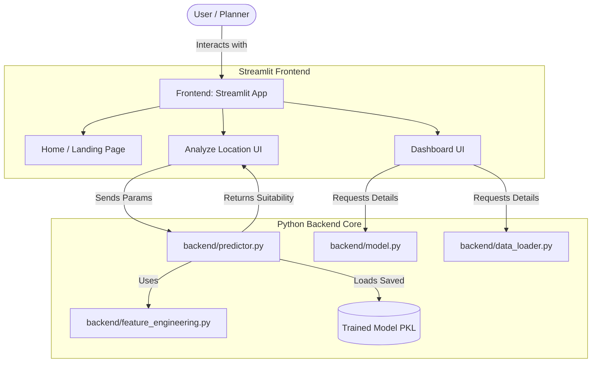
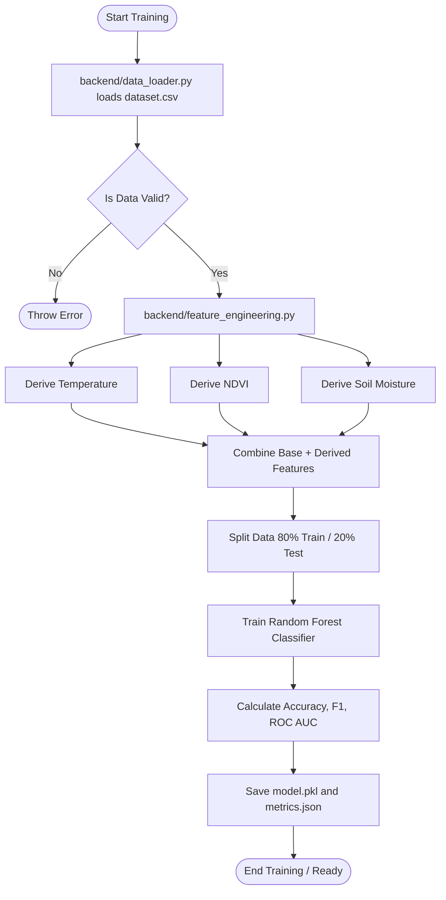
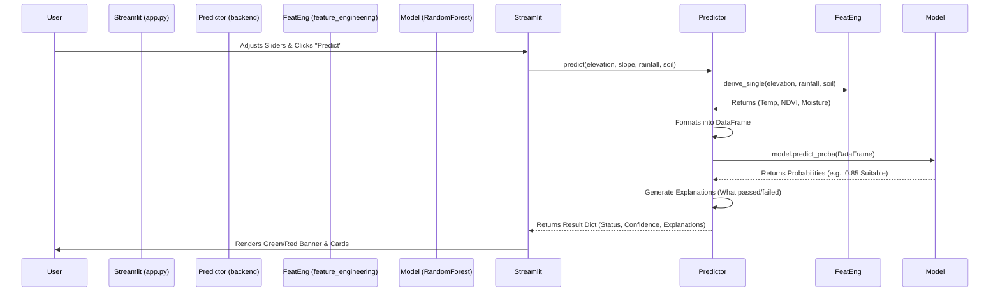

# ☀️ SolarSense Flowcharts & Architecture Diagrams

This document outlines the systematic execution flows of the SolarSense application using Mermaid diagrams. You can render these diagrams in any markdown viewer that supports Mermaid (like GitHub or modern IDEs).

## 1. High-Level System Architecture

This diagram shows how the user interacts with the UI, and how the UI communicates with the isolated backend.



---

## 2. Model Training Pipeline

This flowchart explains what happens behind the scenes when the dataset is generated or when the model is forced to retrain.



---

## 3. Real-Time Prediction Execution Flow

This flowchart details exactly what happens when a user clicks "Predict Land Suitability" in the app.



---

## 4. Batch Processing Flow

How the system handles predicting massive amounts of data at once via CSV upload.

```mermaid
graph LR
    A([User Uploads CSV]) --> B[Streamlit parses to Pandas DF]
    B --> C{Contains Required Columns?}
    C -->|No| D([Return Column Error])
    C -->|Yes| E[backend/predictor.batch_predict()]
    E --> F[Apply Feature Engineering to all rows]
    F --> G[Run Model Prediction over entire batch]
    G --> H[Append 'Prediction' and 'Probability' columns]
    H --> I([User Downloads Result CSV])
```
